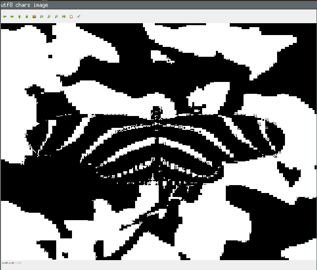

# bmp2chr
bmp2chr transforms bitmap images to unicode text files using a charset image and a map file

## Licenses
This project is released under an MIT license, while the images included in the repository are public domain from Wikimedia Commons
